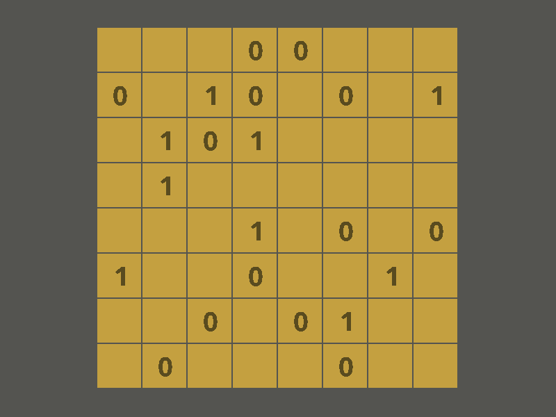

# Binary Puzzle

This is an agent to solve a binary puzzle. This puzzle is and nxn table, 
and we need to fill it with 0s or 1s somehow that three constraints must be
satisfied:

1- Number of 1s and 0s must be the same in a row or column

2- All rows must be different with each other. And columns too.

3- There must not be more than 2 consecutive 1s and 0s in a column or row

The solution uses `Constraint Satisfaction Problem` algorithms to solve the game.

Here is an example of game:


# Run the Game

First you need to install requirements by the following command:

```
$ pip install -r requirements.txt
```

Then type the following command to run the game:

```
$ python3 main.py
```

Result is like this:


